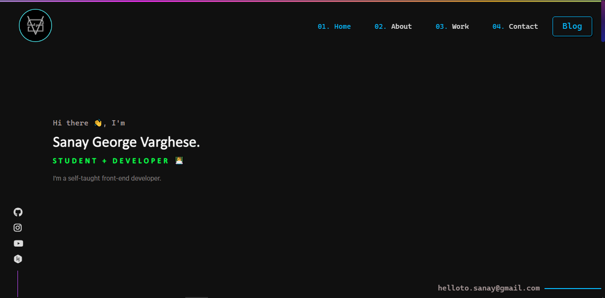

<div align="center">
  
</div>
<h1 align="center">
  Sanay Varghese
</h1>
<p align="center">
  Version 3 of my Protfolio website built with <a href="https://reactjs.org/" target="_blank">React</a> and hosted with
  <a href="https://pages.cloudflare.com/" target="_blank">CloudFlare Pages</a> and managed with <a href="https://cloudflare.com/" target="_blank">Cloudflare CDN</a>

</p>
<p align="center">
  Previous versions:
  <a href="https://github.com/sanayvarghese/thundergear" target="_blank">v1</a>,
  <a href="https://github.com/sanayvarghese/dragongear.tk" target="_blank">v2</a>
</p>
<p align="center">
  <a href="https://app.netlify.com/sites/sanayvarghese/deploys" target="_blank">
    
  </a>
</p>



## 🛠 Installation & Set Up

1. Install the dependencies for the project
   <br/>
   Using NPM

   ```sh
   npm i
   ```

   Using Yarn

   ```sh
   yarn
   ```

1. Start the development server

   ```sh
   npm start
   ```

## 🚀 Building and Running for Production

1. Generate a full static production build

   ```sh
   npm run build
   ```

1. This will generate a build folder which contains the `build` files for production
